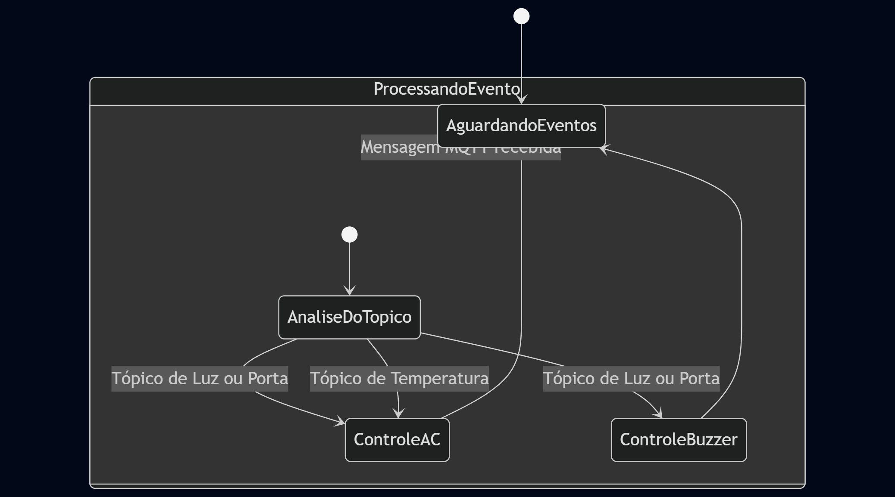
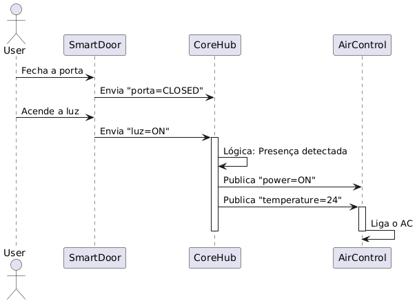
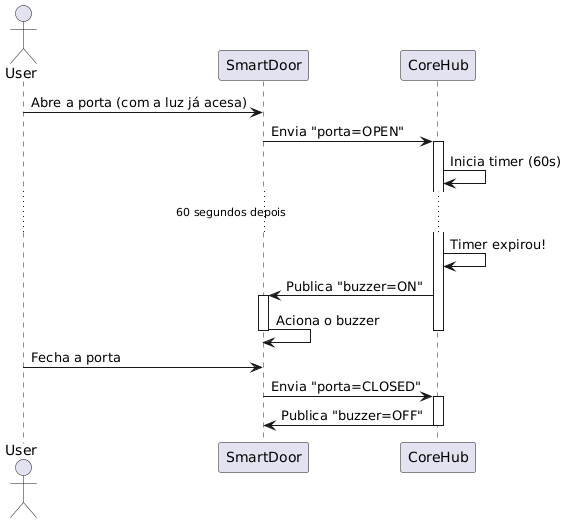

# Playbook de Implementação: Firmware CoreHub

Este documento detalha o plano de trabalho completo para o desenvolvimento do firmware do **CoreHub** no System-in-Package (SiP) **HTNB32L-XXX**. O objetivo é criar um controlador centralizado, robusto e de baixo consumo, seguindo as regras de negócio e utilizando as melhores práticas da SDK da Hana/HT Micron.

---

### **Fase 0: Preparação e Análise do Ambiente**

O sucesso do projeto começa com uma base sólida. Esta fase garante que todas as ferramentas e o conhecimento necessário estejam alinhados antes de escrever a primeira linha de código.

**0.1. Configuração do Ambiente de Desenvolvimento (Setup)**
- **Ação:** Garantir que o ambiente de desenvolvimento esteja 100% configurado conforme o manual `HTNB32L-XXX-UM0001-Getting_Started.pdf`.
- **Checklist:**
  - [ ] Toolchain `gcc-arm-none-eabi` instalada e no PATH.
  - [ ] `make` para Windows instalado e funcional.
  - [ ] VSCode com as extensões recomendadas (`C/C++`, `Cortex-Debug`, `Makefile Tools`).
  - [ ] SDK `HTNB32L-XXX-SDK` clonado para o ambiente local.
  - [ ] Hardware (Breakout Board ou placa customizada) com pinagem SWD e UART acessível.

**0.2. Análise Crítica do Gerenciador de Conexão MQTT**
- **Ação:** Estudar a implementação de referência para o gerenciador de conexões MQTT, disponível no commit `ec54e0b...`.
- **Objetivo:** Entender a máquina de estados finitos (FSM) proposta para lidar com desconexões. Observar como os estados (`IDLE`, `CONNECTING`, `CONNECTED`, `DISCONNECTED`) são gerenciados e como os *retries* com *exponential backoff* são implementados para evitar sobrecarregar a rede em caso de falha.
- **Entregável:** Um diagrama de fluxo ou rascunho da máquina de estados do gerenciador de conexão que será implementado no CoreHub.

**0.3. Estrutura do Projeto na SDK**
- **Ação:** Criar um novo diretório de aplicação dentro de `Firmware/HTNB32L-XXX-SDK/Applications/`.
- **Nome Sugerido:** `CoreHub_App`.
- **Ação:** Copiar a estrutura básica de um dos exemplos existentes (e.g., `MQTT_Example`), contendo as pastas `Inc`, `Src` e um `Makefile` inicial.
- **Ação:** Editar o `Makefile` do projeto `CoreHub_App` para definir o `PROJECT_NAME` e `BINNAME` e habilitar as bibliotecas essenciais (`HT_LIBRARY_MQTT_ENABLE=y`, `DRIVER_USART_ENABLE=y`, etc.), conforme o `HTNB32L-XXX-UM0004-SDK_User_Manual.pdf`.

---

### **Fase 1: Implementação da Camada de Conectividade**

Esta é a fase mais crítica. Uma camada de conectividade instável compromete todo o projeto.

**1.1. Integração do Gerenciador de Conexão MQTT Robusto**
- **Ação:** Com base na análise da Fase 0.2, implementar o gerenciador de conexão em um módulo dedicado (e.g., `ht_conn_manager.c/.h`).
- **Lógica:**
  - Criar uma tarefa FreeRTOS dedicada para gerenciar a conexão MQTT.
  - Implementar a máquina de estados (FSM) que monitora o status da conexão.
  - Em caso de desconexão, a FSM deve tentar reconectar, aumentando o tempo de espera a cada tentativa (exponential backoff) até um limite máximo.
  - A FSM deve notificar o resto da aplicação sobre o status da conexão (e.g., usando um event group ou uma flag global), para que a lógica de negócio só opere quando conectada.

**1.2. Definição e Subscrição de Tópicos MQTT**
- **Ação:** Implementar uma função que, uma vez que o estado seja `CONNECTED`, realize a subscrição em todos os tópicos de entrada necessários.
- **Tópicos a Subscrever:**
  - `hana/<ambiente>/smartdoor/door`
  - `hana/<ambiente>/smartdoor/light`
  - `hana/<ambiente>/senseclima/+/temperature` (usar wildcard `+` para monitorar todos os sensores de um ambiente)
  - (Opcional) `hana/<ambiente>/corehub/config` (para configuração remota)
  - (Opcional) `hana/<ambiente>/aircontrol/+/target_temp` (para receber a temperatura desejada para o AC)

**1.3. Callback Global de Mensagens**
- **Ação:** Implementar a função de callback principal que será invocada pela API da Hana/HT MQTT sempre que uma mensagem chegar.
- **Lógica:** Esta função deve apenas analisar o tópico da mensagem recebida e colocar os dados (tópico e payload) em uma fila (FreeRTOS Queue) para serem processados pela tarefa principal da aplicação. **Evitar lógica de negócio pesada dentro do callback para não bloquear a stack MQTT.**

---

### **Fase 2: Implementação da Lógica de Negócio (CoreHub)**

Com a conectividade estável, esta fase implementa as regras de automação.

**2.1. Máquina de Estados e Gerenciamento de Variáveis**
- **Ação:** Criar a tarefa principal da aplicação (`corehub_task`). Esta tarefa ficará bloqueada, aguardando mensagens na fila preenchida pelo callback MQTT.
- **Ação:** Definir uma `struct` global para armazenar o estado atual do sistema (ex: `CoreHubState`).
  ```c
  // Exemplo de estrutura de estado
  typedef struct {
      bool is_door_open;
      bool is_light_on;
      float last_temperature;
      bool is_ac_on;
      int target_ac_temp;
      bool is_buzzer_on;
      // ... outros estados e configurações ...
  } CoreHubState_t;
  ```
- **Ação:** Ao receber uma mensagem da fila, a `corehub_task` atualiza a `CoreHubState_t` e executa a lógica de decisão.

**2.2. Lógica de Controle do Buzzer**
- **Ação:** Utilizar um timer de software do FreeRTOS.
- **Gatilho:** Quando a aplicação receber `luz=ON` E `porta=OPEN`.
- **Processo:**
  1. Iniciar um timer com o tempo de tolerância (ex: 60 segundos).
  2. Se o timer expirar e as condições ainda forem verdadeiras, publicar `ON` para `hana/<ambiente>/smartdoor/buzzer`.
  3. Se a porta for fechada ou a luz apagada antes do timer expirar, o timer deve ser parado e resetado, e uma mensagem `OFF` deve ser publicada para o buzzer para garantir que ele esteja desligado.

**2.3. Lógica de Controle de Climatização (Ar-Condicionado)**
- **Ação:** Implementar a lógica de decisão baseada na hierarquia de regras. A presença (luz acesa) é o gatilho principal, e a temperatura é o controle fino.
- **Processo:**
  1. **Gatilho por Presença (`SmartDoor`):**
     - Ao receber `luz=ON` E `porta=CLOSED`: Indica presença e ambiente fechado.
       - Publicar `power=ON` para `hana/<ambiente>/aircontrol/<equipamento>/power`.
       - Recuperar a última temperatura alvo da NVM/Flash (ver Fase 3). Se não houver, usar o padrão (24°C). Publicar no tópico `.../temperature`.
     - Ao receber `luz=OFF`: Indica ausência de pessoas.
       - Publicar `power=OFF` para `hana/<ambiente>/aircontrol/<equipamento>/power`. A lógica de temperatura é ignorada.
  2. **Ajuste por Temperatura (`SenseClima`):**
     - Ao receber uma nova temperatura de `.../senseclima/+/temperature`:
     - Verificar se a lógica de presença já ligou o AC (`is_ac_on == true`).
     - Se `temperatura_lida > LIMITE_SUPERIOR` (ex: 28°C), garantir que o AC seja ligado (publicar `power=ON`).
     - Se `temperatura_lida < LIMITE_INFERIOR` (ex: 24°C), desligar o AC para economizar energia (publicar `power=OFF`). **Esta regra tem prioridade sobre a regra de presença para desligar o AC.**

---

### **Fase 3: Implementação de Recursos Opcionais (Persistência e Configuração)**

Esta fase adiciona flexibilidade e robustez ao sistema.

**3.1. Gerenciamento de NVM (Non-Volatile Memory)**
- **Referência:** `HTNB32L-XXX-UM0005-PMU_SleepModes.pdf`, seção "User NVM".
- **Ação:** Definir uma `struct` para os parâmetros configuráveis (limites de temperatura, tempo do buzzer, última temperatura do AC).
- **Ação:** Ao ligar, carregar essa `struct` da Flash usando as APIs do sistema de arquivos (`OsaFopen`, `OsaFread`). Se o arquivo não existir ou estiver corrompido, criar com valores padrão.
- **Ação:** Sempre que um parâmetro for alterado (via MQTT ou internamente), atualizar a `struct` em RAM e gravá-la na Flash usando `OsaFwrite`.

**3.2. Configuração Dinâmica via MQTT**
- **Ação:** Criar uma função para tratar mensagens recebidas nos tópicos de configuração opcionais.
- **Lógica:**
  - Receber a mensagem (ex: no tópico `hana/<ambiente>/corehub/config`, payload `{"temp_max": 29, "temp_min": 25}`).
  - Validar e parsear o payload (pode-se usar uma biblioteca C-JSON se incluída no projeto).
  - Atualizar a `struct` de configuração em RAM.
  - Chamar a função da Fase 3.1 para persistir as novas configurações na Flash.

---

### **Fase 4: Otimização de Energia e Finalização**

Um dispositivo IoT deve ser energeticamente eficiente.

**4.1. Implementação de Modos de Baixo Consumo (Sleep Modes)**
- **Referência:** `HTNB32L-XXX-UM0005-PMU_SleepModes.pdf`.
- **Ação:** Utilizar a arquitetura do exemplo `Slpman_Example` como base.
- **Lógica:**
  - Após processar um evento, a `corehub_task` não deve usar delays (`OsDelay`), mas sim votar para permitir que o sistema entre em modo de sono (`slpManPlatVoteEnableSleep`).
  - Utilizar os mecanismos de votação do `Sleep Manager` para garantir que o dispositivo só permaneça ativo quando necessário (e.g., durante uma transação MQTT).
  - O objetivo é manter o SiP no estado de sono mais profundo possível, sendo acordado apenas por interrupções de rede (mensagens MQTT).

**4.2. Testes Integrados e Validação**
- **Ação:** Utilizar os simuladores Python (`smartdoor_simulator.py`, `senseclima_simulator...`, `aircontrol_simulator...`) para testar exaustivamente todas as regras de negócio.
- **Checklist de Testes:**
  - [ ] Testar a lógica do buzzer (porta aberta + luz acesa > 60s).
  - [ ] Testar o acionamento do AC com `luz=ON`.
  - [ ] Testar o desligamento do AC com `luz=OFF`.
  - [ ] Testar o override de temperatura (AC desliga com temp baixa mesmo com luz acesa).
  - [ ] Testar a persistência de dados (reiniciar o CoreHub e verificar se ele recupera a última temperatura do AC).
  - [ ] Testar a robustez da conexão MQTT (desligar e ligar o broker ou a rede).

---

### **Fase 5: Preparação para Deploy**

**5.1. Limpeza de Código e Documentação**
- **Ação:** Remover logs de debug desnecessários ou colocá-los sob flags de compilação (`#ifdef COREHUB_DEBUG`).
- **Ação:** Documentar as funções principais, a máquina de estados e as configurações no código.

**5.2. Geração do Binário Final**
- **Ação:** Compilar a versão final do projeto (`release build`).
- **Ação:** Utilizar o `HTTools` (`HTNB32L-XXX-UM0003-HTTools.pdf`) para gravar o firmware no dispositivo de produção.

---

### **Fase 6: Visualização da Lógica de Negócio**

Esta seção consolida as regras de negócio em um formato visual para facilitar a compreensão e a validação.

**6.1. Resumo das Regras de Negócio**

1.  **Controle do Ar-Condicionado (AC):**
    - **Gatilho Primário (Presença):** O AC é ligado (`power=ON`) apenas se a `luz` estiver `ON` E a `porta` estiver `CLOSED`. Se a `luz` for desligada (`OFF`), o AC também é desligado, indicando que não há mais ninguém na sala.
    - **Controle Fino (Temperatura):**
        - Uma vez que o AC esteja ligado pela regra de presença, a temperatura ambiente (`SenseClima`) assume o controle.
        - Se a temperatura ambiente ultrapassar um `LIMITE_SUPERIOR` (ex: 28°C), o AC é (ou permanece) ligado.
        - Se a temperatura ambiente cair abaixo de um `LIMITE_INFERIOR` (ex: 24°C), o AC é desligado para economizar energia, **mesmo que a luz ainda esteja acesa**.
    - **Memória de Temperatura:** Ao ligar o AC, a temperatura alvo é recuperada da memória NVM. Se não houver valor salvo, o padrão de 24°C é utilizado.

2.  **Alarme de Porta Aberta (Buzzer):**
    - **Gatilho:** O alarme é ativado apenas se a `luz` estiver `ON` E a `porta` estiver `OPEN` por um tempo contínuo superior a um `TEMPO_DE_TOLERANCIA` (ex: 60s).
    - **Desativação:** O alarme é desativado (`buzzer=OFF`) assim que uma das condições do gatilho for desfeita (porta fechar ou luz apagar).

**6.2. Diagrama de Estados (MermaidJS)**

Este diagrama ilustra a máquina de estados principal do CoreHub.



**6.3. Diagrama de Sequência de Climatização (PlantUML)**

Este diagrama mostra a interação para ligar o ar-condicionado.



**6.4. Diagrama de Sequência do Alarme (PlantUML)**

Este diagrama mostra a interação para acionar o alarme de porta aberta.


