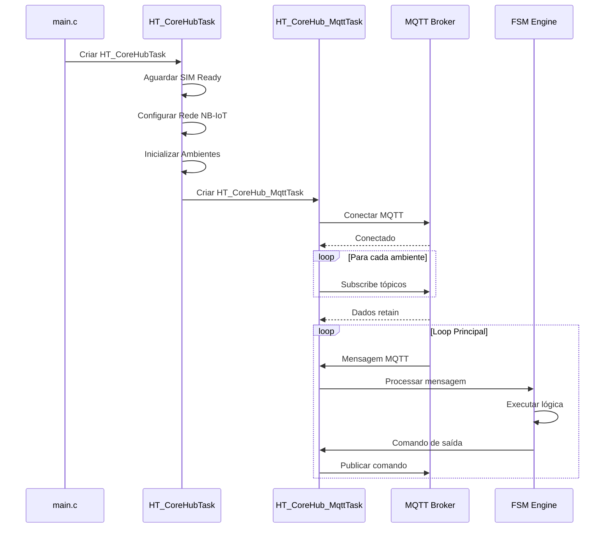
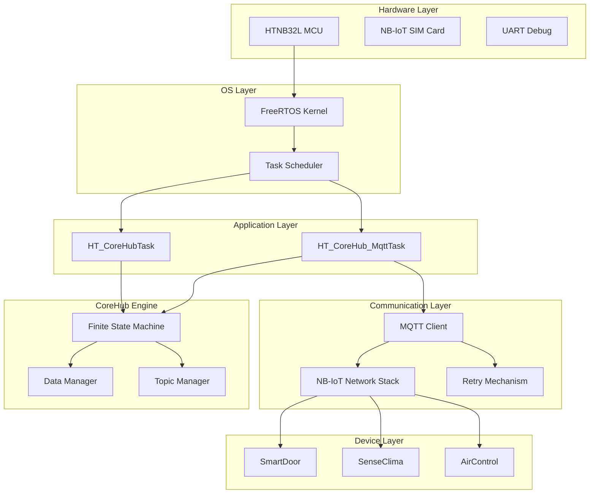
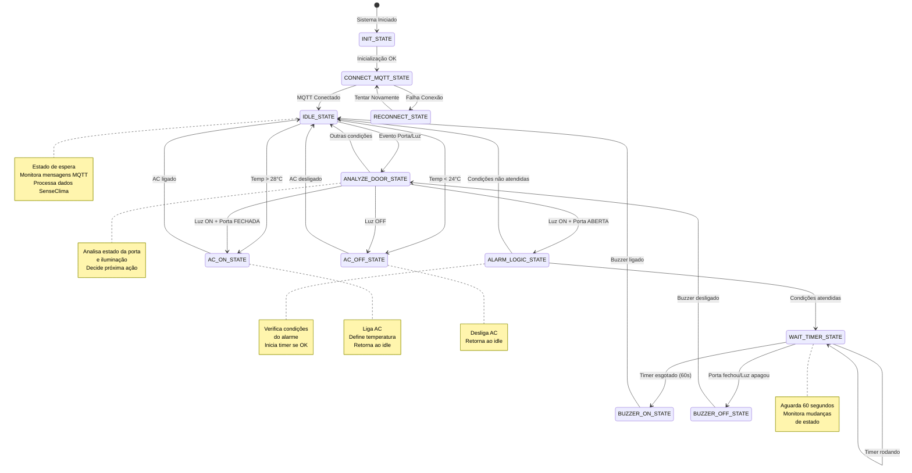
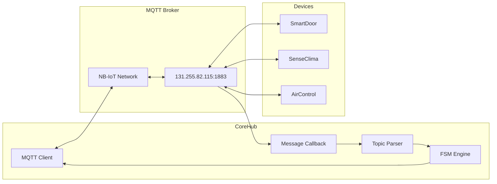
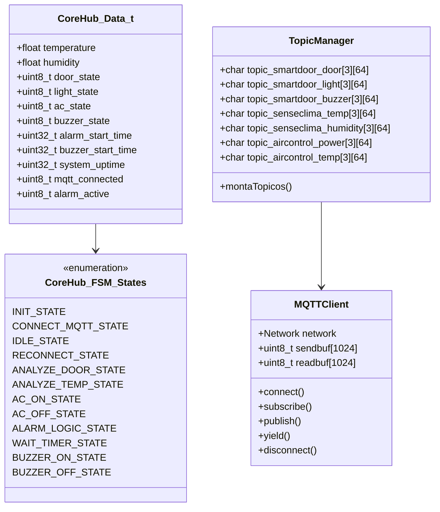
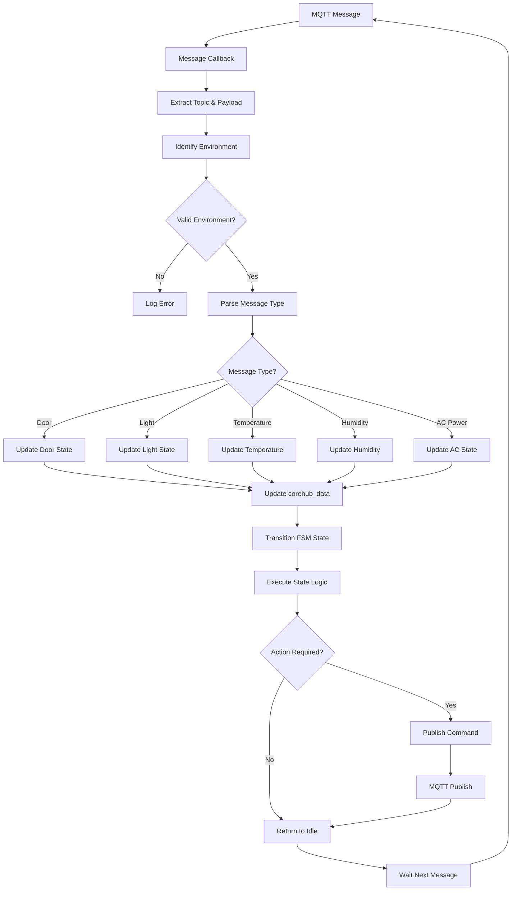
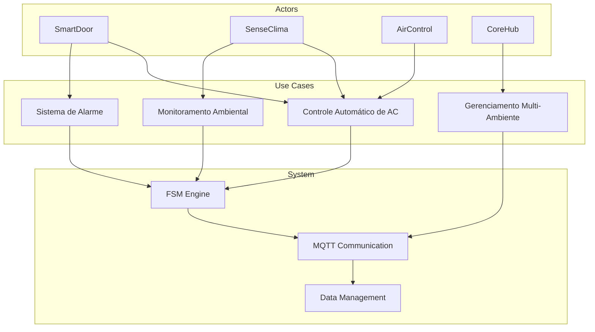
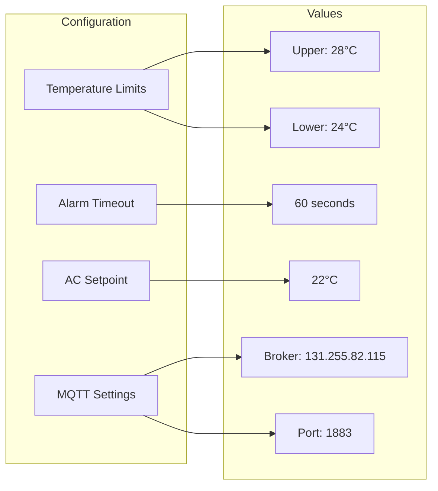
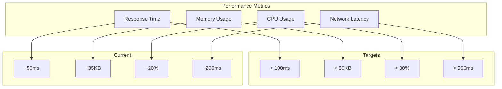

# 📊 Diagramas Técnicos - CoreHub Sistema de Automação Inteligente

## 🔄 Diagrama de Sequência - Inicialização do Sistema

## 🏗️ Diagrama de Arquitetura Detalhada

## 🔄 Diagrama de Estados Detalhado

## 📡 Diagrama de Comunicação MQTT

## 🔧 Diagrama de Estruturas de Dados

## 🔄 Diagrama de Fluxo de Dados

## 🎯 Diagrama de Casos de Uso

## 🔧 Diagrama de Configuração

## 📊 Diagrama de Performance

---

## 📋 Legenda dos Diagramas

### Símbolos Utilizados:
- **🔄**: Fluxo de dados/controle
- **📡**: Comunicação/redes
- **🏗️**: Arquitetura/estrutura
- **🔧**: Configuração/implementação
- **📊**: Métricas/performance
- **🎯**: Casos de uso/requisitos

### Cores:
- **Azul**: Componentes principais
- **Verde**: Estados/processos
- **Laranja**: Interfaces/comunicação
- **Vermelho**: Erros/alertas
- **Roxo**: Configurações/dados

---

*Diagramas gerados automaticamente - CoreHub v1.0* 