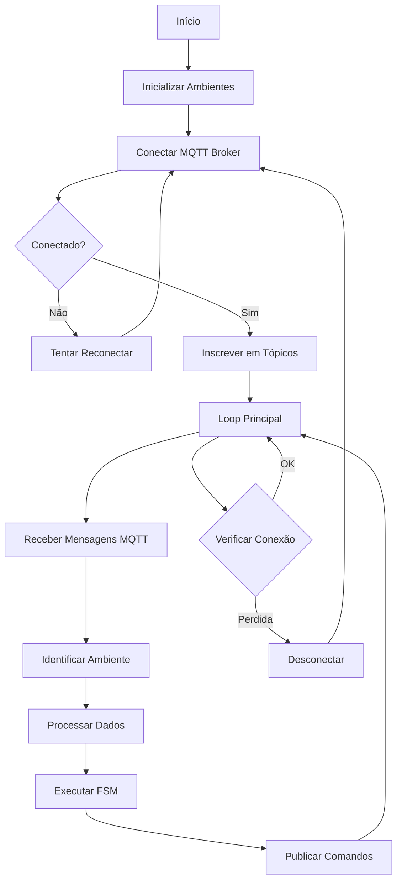
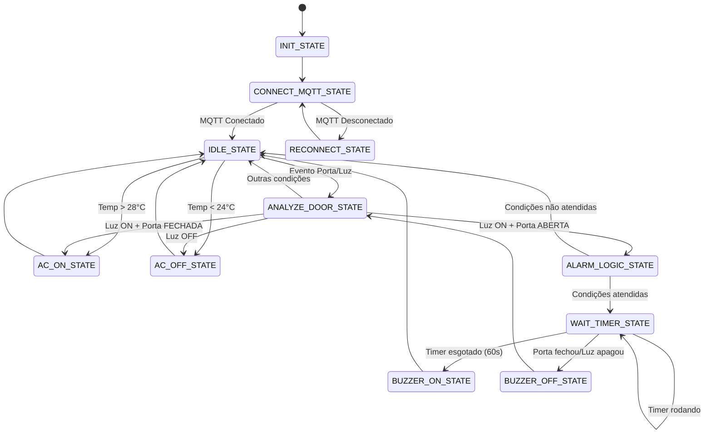
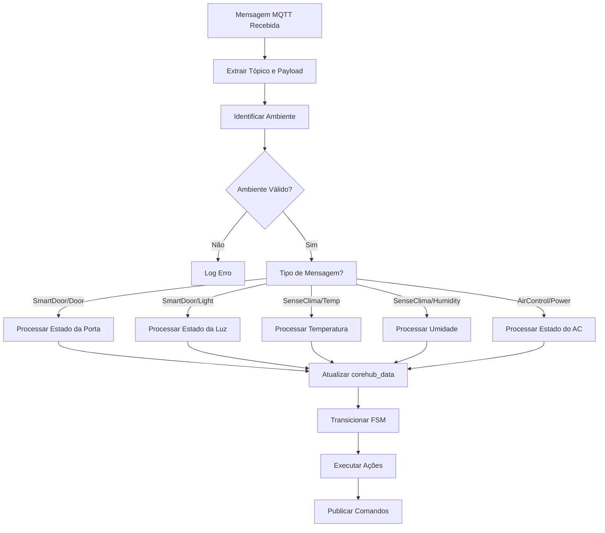

# 🏢 CoreHub - Sistema de Automação Inteligente

## 📋 Índice
- [Visão Geral](#visão-geral)
- [Arquitetura do Sistema](#arquitetura-do-sistema)
- [Fluxogramas](#fluxogramas)
- [Organogramas](#organogramas)
- [Componentes](#componentes)
- [Protocolos de Comunicação](#protocolos-de-comunicação)
- [Instalação e Configuração](#instalação-e-configuração)
- [API e Integração](#api-e-integração)
- [Troubleshooting](#troubleshooting)
- [Contribuição](#contribuição)

---

## 🎯 Visão Geral

O **CoreHub** é um sistema central de automação inteligente que integra múltiplos ambientes através de comunicação MQTT via **NB-IoT**. O sistema gerencia dispositivos inteligentes como SmartDoor, SenseClima e AirControl, implementando lógica de controle automático baseada em condições ambientais e de segurança.

### 🎯 Objetivos Principais
- **Automação Inteligente**: Controle automático de ar condicionado baseado em temperatura
- **Segurança**: Sistema de alarme com buzzer para portas abertas com luz acesa
- **Multi-Ambiente**: Gerenciamento simultâneo de múltiplos ambientes
- **Comunicação NB-IoT**: Sistema MQTT robusto com conectividade celular de baixo consumo
- **Confiabilidade**: Retry automático e reconexão inteligente

---

## 🏗️ Arquitetura do Sistema

```
┌─────────────────────────────────────────────────────────────────┐
│                        COREHUB SYSTEM                           │
├─────────────────────────────────────────────────────────────────┤
│                                                                 │
│  ┌─────────────────┐    ┌─────────────────┐    ┌──────────────┐ │
│  │   AMBIENTE 1    │    │   AMBIENTE 2    │    │  AMBIENTE 3  │ │
│  │   "externo"     │    │   "mesanino"    │    │"prototipagem"│ │
│  └─────────────────┘    └─────────────────┘    └──────────────┘ │
│           │                       │                       │     │
│           └───────────────────────┼───────────────────────┘     │
│                                   │                             │
│  ┌─────────────────────────────────────────────────────────────┐│
│  │                    CLIENTE MQTT ÚNICO                       ││
│  │  ┌─────────────────┐  ┌─────────────────┐  ┌──────────────┐ ││
│  │  │   SmartDoor     │  │   SenseClima    │  │  AirControl  │ ││
│  │  │  - Door State   │  │  - Temperature  │  │  - Power     │ ││
│  │  │  - Light State  │  │  - Humidity     │  │  - Temp Set  │ ││
│  │  │  - Buzzer       │  │                 │  │              │ ││
│  │  └─────────────────┘  └─────────────────┘  └──────────────┘ ││
│  └─────────────────────────────────────────────────────────────┘│
│                                   │                             │
│  ┌─────────────────────────────────────────────────────────────┐│
│  │                    MQTT BROKER                              ││
│  │                131.255.82.115:1883                          ││
│  │                    via NB-IoT                               ││
│  └─────────────────────────────────────────────────────────────┘│
│                                                                 │
└─────────────────────────────────────────────────────────────────┘
```

---

## 🔄 Fluxogramas

### 1. Fluxograma Principal do CoreHub



### 2. Fluxograma da FSM (Máquina de Estados)



### 3. Fluxograma de Processamento de Mensagens



---

## 📊 Organogramas

### 1. Organograma de Tarefas FreeRTOS

```
┌─────────────────────────────────────────────────────────────────┐
│                    FREE RTOS KERNEL                             │
├─────────────────────────────────────────────────────────────────┤
│                                                                 │
│  ┌─────────────────────────────────────────────────────────────┐│
│  │                 HT_CoreHubTask                              ││
│  │              (Prioridade Normal)                            ││
│  │  ┌─────────────────────────────────────────────────────┐    ││
│  │  │              Inicialização                          │    ││
│  │  │  • Aguardar SIM Ready                               │    ││
│  │  │  • Configurar Rede NB-IoT                           │    ││
│  │  │  • Inicializar Ambientes                            │    ││
│  │  │  • Criar Task MQTT Global                           │    ││
│  │  └─────────────────────────────────────────────────────┘    ││
│  └─────────────────────────────────────────────────────────────┘│
│                                   │                             │
│  ┌─────────────────────────────────────────────────────────────┐│
│  │              HT_CoreHub_MqttTask                            ││
│  │           (Prioridade Máxima)                               ││
│  │  ┌─────────────────────────────────────────────────────┐    ││
│  │  │              Processamento MQTT                     │    ││
│  │  │  • Conexão MQTT Broker                              │    ││
│  │  │  • Subscribe em Tópicos                             │    ││
│  │  │  • Receber Mensagens                                │    ││
│  │  │  • Executar FSM para todos os ambientes             │    ││
│  │  │  • Publicar Comandos                                │    ││
│  │  └─────────────────────────────────────────────────────┘    ││
│  └─────────────────────────────────────────────────────────────┘│
│                                                                 │
└─────────────────────────────────────────────────────────────────┘
```

### 2. Organograma de Estruturas de Dados

```
┌─────────────────────────────────────────────────────────────────┐
│                    ESTRUTURAS DE DADOS                          │
├─────────────────────────────────────────────────────────────────┤
│                                                                 │
│  ┌────────────────────────────────────────────────────────────┐ │
│  │              CoreHub_Data_t [NUM_AMBIENTES]                │ │
│  │  ┌─────────────┐  ┌─────────────┐  ┌─────────────────────┐ │ │
│  │  │ Ambiente 0  │  │ Ambiente 1  │  │    Ambiente 2       │ │ │
│  │  │ "externo"   │  │ "mesanino"  │  │  "prototipagem"     │ │ │
│  │  │             │  │             │  │                     │ │ │
│  │  │ • temp      │  │ • temp      │  │  • temp             │ │ │
│  │  │ • humidity  │  │ • humidity  │  │  • humidity         │ │ │
│  │  │ • door      │  │ • door      │  │  • door             │ │ │
│  │  │ • light     │  │ • light     │  │  • light            │ │ │
│  │  │ • ac        │  │ • ac        │  │  • ac               │ │ │
│  │  │ • buzzer    │  │ • buzzer    │  │  • buzzer           │ │ │
│  │  │ • alarm     │  │ • alarm     │  │  • alarm            │ │ │
│  │  └─────────────┘  └─────────────┘  └─────────────────────┘ │ │
│  └────────────────────────────────────────────────────────────┘ │
│                                   │                             │
│  ┌────────────────────────────────────────────────────────────┐ │
│  │              current_state [NUM_AMBIENTES]                 │ │
│  │  ┌─────────────┐  ┌─────────────┐  ┌─────────────────────┐ │ │
│  │  │ Estado 0    │  │ Estado 1    │  │    Estado 2         │ │ │
│  │  │ IDLE_STATE  │  │ IDLE_STATE  │  │  IDLE_STATE         │ │ │
│  │  └─────────────┘  └─────────────┘  └─────────────────────┘ │ │
│  └────────────────────────────────────────────────────────────┘ │
│                                   │                             │
│  ┌────────────────────────────────────────────────────────────┐ │
│  │              Tópicos MQTT [NUM_AMBIENTES]                  │ │
│  │  ┌─────────────┐  ┌─────────────┐  ┌─────────────────────┐ │ │
│  │  │ Topics 0    │  │ Topics 1    │  │    Topics 2         │ │ │
│  │  │ • door      │  │ • door      │  │  • door             │ │ │
│  │  │ • light     │  │ • light     │  │  • light            │ │ │
│  │  │ • buzzer    │  │ • buzzer    │  │  • buzzer           │ │ │
│  │  │ • temp      │  │ • temp      │  │  • temp             │ │ │
│  │  │ • humidity  │  │ • humidity  │  │  • humidity         │ │ │
│  │  │ • ac_power  │  │ • ac_power  │  │  • ac_power         │ │ │
│  │  │ • ac_temp   │  │ • ac_temp   │  │  • ac_temp          │ │ │
│  │  └─────────────┘  └─────────────┘  └─────────────────────┘ │ │
│  └────────────────────────────────────────────────────────────┘ │
│                                                                 │
└─────────────────────────────────────────────────────────────────┘
```

---

## 🔧 Componentes

### 1. SmartDoor
- **Função**: Controle de porta e iluminação
- **Tópicos**:
  - `hana/{ambiente}/smartdoor/door` → `OPEN/CLOSED`
  - `hana/{ambiente}/smartdoor/light` → `ON/OFF`
  - `hana/{ambiente}/smartdoor/buzzer` → `ON/OFF`

### 2. SenseClima
- **Função**: Monitoramento ambiental
- **Tópicos**:
  - `hana/{ambiente}/senseclima/01/temperature` → `float`
  - `hana/{ambiente}/senseclima/01/humidity` → `float`

### 3. AirControl
- **Função**: Controle de ar condicionado
- **Tópicos**:
  - `hana/{ambiente}/aircontrol/01/power` → `ON/OFF`
  - `hana/{ambiente}/aircontrol/01/temperature` → `int`

---

## 📡 Protocolos de Comunicação

### 🛰️ Tecnologia NB-IoT

O CoreHub utiliza **NB-IoT (Narrowband Internet of Things)** como tecnologia de comunicação, oferecendo:

- **Baixo Consumo**: Otimizado para dispositivos IoT de longa duração
- **Cobertura Estendida**: Melhor penetração em ambientes fechados
- **Custo Reduzido**: Tarifação baseada em volume de dados
- **Confiabilidade**: Rede celular robusta e estável
- **Segurança**: Comunicação criptografada via rede móvel

#### Configurações NB-IoT
```c
// Configurações de Rede
#define NETWORK_MODE NB_IOT_MODE
#define BAND_NUMBER 1
#define BAND_FREQUENCY 28
#define APN "iot.datatem.com.br"

// Configurações de Energia
#define PSM_MODE 1
#define TAU_TIME 4000
#define ACTIVE_TIME 30
```

### MQTT Configuration via NB-IoT
```c
// Broker Settings
#define BROKER_ADDR "131.255.82.115"
#define BROKER_PORT 1883
#define CLIENT_ID "corehub01"
#define KEEP_ALIVE 240

// NB-IoT Settings
#define NETWORK_MODE NB_IOT_MODE
#define BAND_NUMBER 1
#define BAND_FREQUENCY 28
#define APN "iot.datatem.com.br"
```

// QoS Levels
#define QOS_LEVEL QOS0  // At most once delivery

// Buffer Sizes
#define MQTT_BUFFER_SIZE 1024
#define SEND_TIMEOUT 60000
#define RECEIVE_TIMEOUT 60000
```

### Topic Structure
```
hana/
├── {ambiente}/
│   ├── smartdoor/
│   │   ├── door
│   │   ├── light
│   │   └── buzzer
│   ├── senseclima/
│   │   └── 01/
│   │       ├── temperature
│   │       └── humidity
│   └── aircontrol/
│       └── 01/
│           ├── power
│           └── temperature
```

---

## ⚙️ Instalação e Configuração

### Pré-requisitos
- Compilador ARM GCC
- FreeRTOS
- MQTT Client Library
- HTNB32L SDK
- SIM Card NB-IoT
- Cobertura de rede celular

### Compilação
```bash
# Compilar o projeto
make -j4 gccall TARGET=qcx212_0h00 V=0 PROJECT=Template

# Flash para dispositivo
make flash TARGET=qcx212_0h00 PROJECT=Template
```

### Configuração de Ambientes
```c
// Definir ambientes no main.c
const char* ambientes[NUM_AMBIENTES] = {
    "externo",      // Ambiente 0
    "mesanino",     // Ambiente 1
    "prototipagem"  // Ambiente 2
};
```

---

## 🔌 API e Integração

### Funções Principais

#### Inicialização
```c
// Inicializar ambiente específico
void HT_CoreHub_InitAmbiente(int ambiente_idx, const char* nome);

// Iniciar task MQTT global
void HT_CoreHub_MqttTask(void *pvParameters);
```

#### Estados da FSM
```c
typedef enum {
    COREHUB_INIT_STATE = 0,
    COREHUB_CONNECT_MQTT_STATE,
    COREHUB_IDLE_STATE,
    COREHUB_RECONNECT_STATE,
    COREHUB_ANALYZE_DOOR_STATE,
    COREHUB_ANALYZE_TEMP_STATE,
    COREHUB_AC_ON_STATE,
    COREHUB_AC_OFF_STATE,
    COREHUB_ALARM_LOGIC_STATE,
    COREHUB_WAIT_TIMER_STATE,
    COREHUB_BUZZER_ON_STATE,
    COREHUB_BUZZER_OFF_STATE
} CoreHub_FSM_States;
```

### Configurações
```c
// Limites de temperatura
#define HT_COREHUB_TEMP_LIMIT_UPPER 28.0f
#define HT_COREHUB_TEMP_LIMIT_LOWER 24.0f

// Timeout do alarme
#define HT_COREHUB_ALARM_TIMEOUT_MS 60000

// Setpoint do AC
#define HT_COREHUB_AC_TEMP_SETPOINT 22
```

---

## 🔍 Troubleshooting

### Problemas Comuns

#### 1. Conexão MQTT Falha
```
[ERRO] Falha na conexão MQTT (erro: -1)
```
**Solução**: Verificar conectividade de rede e configurações do broker

#### 2. Ambiente Não Identificado
```
[ERRO] Ambiente não identificado para tópico: hana/test/door
```
**Solução**: Verificar se o ambiente está na lista `ambientes[]`

#### 3. Buffer Overflow
```
[ERRO] Buffer overflow no tópico MQTT
```
**Solução**: Aumentar `HT_COREHUB_MQTT_BUFFER_SIZE`

### Logs de Debug
```c
// Habilitar logs detalhados
printf("CoreHub[%s] - DEBUG: %s\n", ambientes[ambiente_idx], message);

// Logs de estado da FSM
printf("CoreHub - FSM: %s\n", state_name);
```

---

## 🤝 Contribuição

### Estrutura do Projeto
```
Firmware/
├── Applications/
│   └── Template/
│       ├── Inc/
│       │   ├── HT_CoreHubFsm.h
│       │   └── CoreHub_Config.h
│       └── Src/
│           ├── main.c
│           ├── HT_CoreHubFsm.c
│           └── HT_MQTT_Api.c
├── SDK/
│   └── Thirdparty/
│       └── MQTT/
└── Build/
```

### Padrões de Código
- **Nomenclatura**: Prefixo `HT_` para funções públicas
- **Comentários**: Documentação em português
- **Logs**: Formato `CoreHub[ambiente] - mensagem`
- **Estados**: Enum com prefixo `COREHUB_`

### Testes
```bash
# Teste de compilação
make clean && make all

# Teste de conectividade MQTT
# Usar ferramentas como MQTT Explorer
```

---

## 📄 Licença

Este projeto está licenciado sob a Apache License 2.0.

---

## 📞 Suporte

Para suporte técnico ou dúvidas:
- **Email**: suporte@corehub.com
- **Documentação**: [Wiki do Projeto](https://github.com/corehub/wiki)
- **Issues**: [GitHub Issues](https://github.com/corehub/issues)

---

*Documentação gerada automaticamente - CoreHub v1.0* 