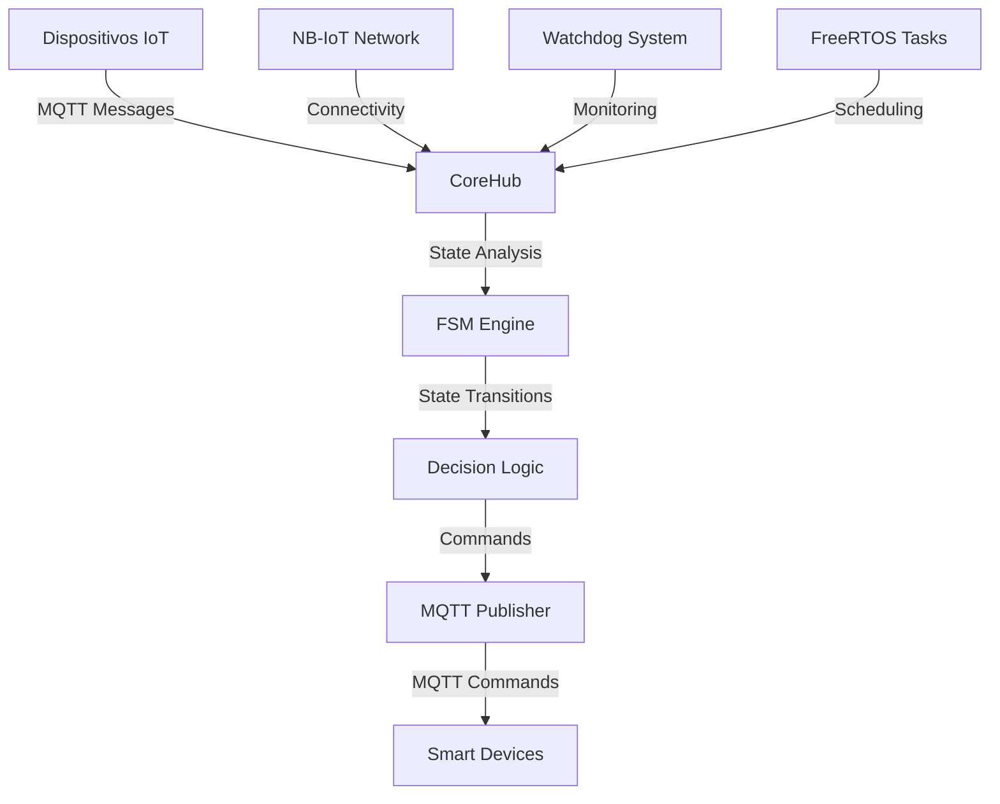
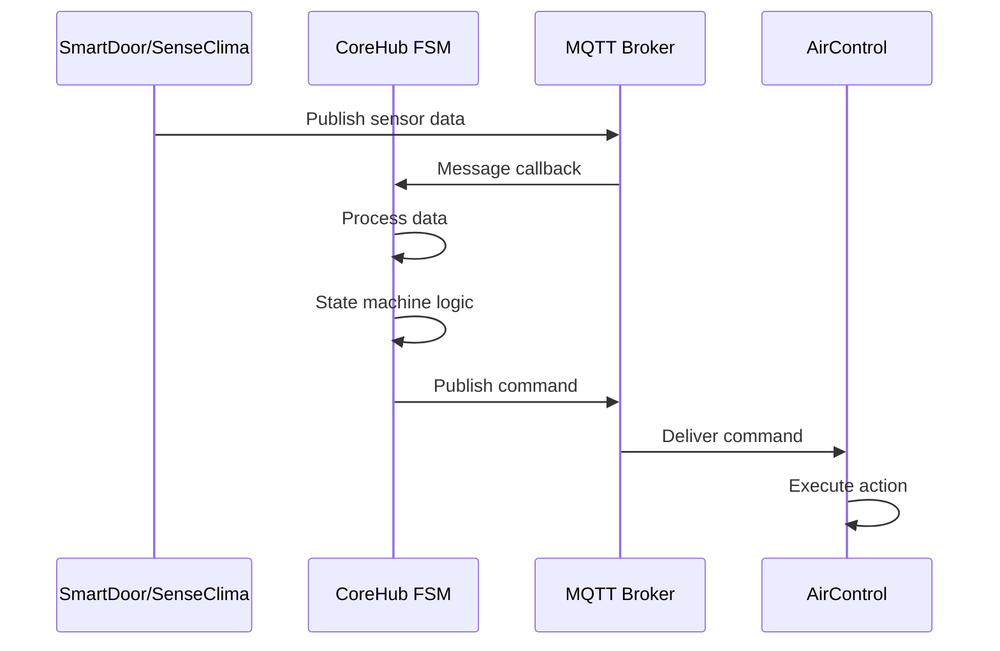
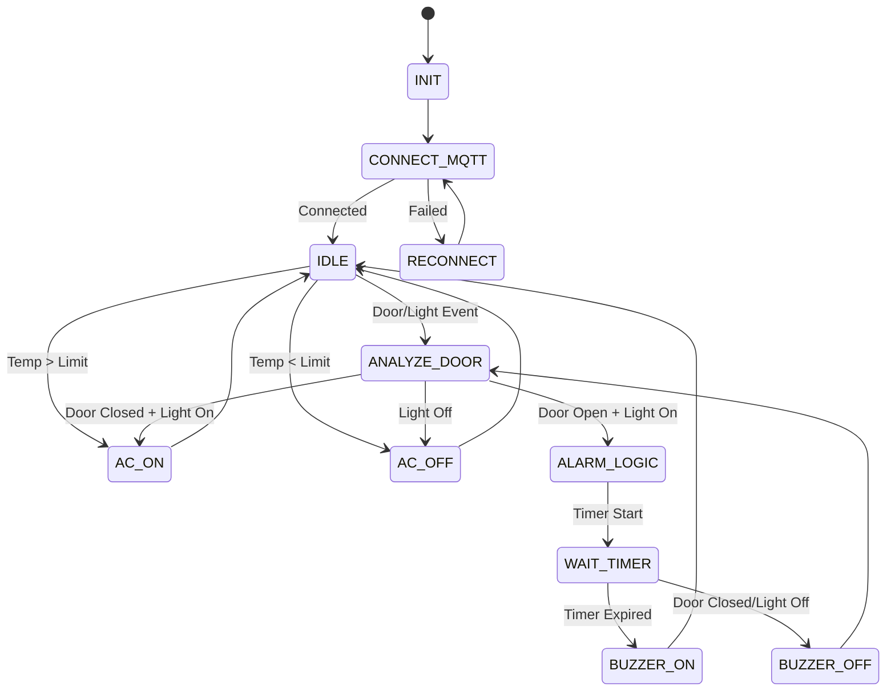

# 🏗️ Arquitetura do CoreHub

> **Sistema de Automação com iMCP HTNB32L**  
> **Visão Geral da Arquitetura do Sistema de Automação Inteligente**

---

## 📋 Índice

1. [Visão Geral](#visão-geral)
2. [Camadas da Arquitetura](#camadas-da-arquitetura)
3. [Componentes Principais](#componentes-principais)
4. [Fluxo de Dados](#fluxo-de-dados)
5. [Comunicação MQTT](#comunicação-mqtt)
6. [Sistema de Estados](#sistema-de-estados)
7. [Segurança e Confiabilidade](#segurança-e-confiabilidade)

---

## 🎯 Visão Geral

O CoreHub é um sistema arquitetado como um sistema distribuído baseado em **MQTT** com conectividade **NB-IoT**, utilizando a plataforma **iMCP HTNB32L** como base de desenvolvimento. O projeto demonstra a aplicação prática de conceitos de **IoT**, **sistemas embarcados** e **automação inteligente**.

### 🏛️ Princípios Arquiteturais

- **🔄 Event-Driven**: Baseado em eventos MQTT
- **🏢 Multi-Tenant**: Suporte a múltiplos ambientes
- **🛡️ Fault-Tolerant**: Sistema robusto com watchdog
- **⚡ Real-Time**: Operação em tempo real com FreeRTOS
- **📡 Low-Power**: Otimizado para NB-IoT

---

## 🏗️ Camadas da Arquitetura

```
┌─────────────────────────────────────────────────────────────┐
│                    APLICAÇÃO                                │
│  ┌─────────────┐  ┌─────────────┐  ┌─────────────┐          │
│  │   CoreHub   │  │   FSM       │  │   Watchdog  │          │
│  │   Logic     │  │   Engine    │  │   System    │          │
│  └─────────────┘  └─────────────┘  └─────────────┘          │
├─────────────────────────────────────────────────────────────┤
│                    COMUNICAÇÃO                              │
│  ┌─────────────┐  ┌─────────────┐  ┌─────────────┐          │
│  │   MQTT      │  │   Protocol  │  │   Topics    │          │
│  │   Client    │  │   Handler   │  │   Manager   │          │
│  └─────────────┘  └─────────────┘  └─────────────┘          │
├─────────────────────────────────────────────────────────────┤
│                    REDE                                     │
│  ┌─────────────┐  ┌─────────────┐  ┌─────────────┐          │
│  │   NB-IoT    │  │     LTE     │  │    APN      │          │ 
│  │   Stack     │  │   Network   │  │   Config    │          │
│  └─────────────┘  └─────────────┘  └─────────────┘          │
├─────────────────────────────────────────────────────────────┤
│                    SISTEMA                                  │
│  ┌─────────────┐  ┌─────────────┐  ┌─────────────┐          │
│  │   FreeRTOS  │  │   Tasks     │  │   Memory    │          │
│  │   Kernel    │  │   Manager   │  │   Manager   │          │
│  └─────────────┘  └─────────────┘  └─────────────┘          │
├─────────────────────────────────────────────────────────────┤
│                    HARDWARE                                 │
│  ┌─────────────┐  ┌─────────────┐  ┌─────────────┐          │
│  │   iMCP      │  │   NB-IoT    │  │   Peripherals│         │
│  │   HTNB32L   │  │   Module    │  │   (UART,GPIO)│         │
│  └─────────────┘  └─────────────┘  └─────────────┘          │
└─────────────────────────────────────────────────────────────┘
```

---

## 🔧 Componentes Principais

### 🧠 CoreHub Logic
```c
// Estrutura principal do CoreHub
typedef struct {
    CoreHub_Data_t data[NUM_AMBIENTES];           // Dados por ambiente
    CoreHub_FSM_States state[NUM_AMBIENTES];      // Estados FSM
    MQTTClient mqtt_client;                       // Cliente MQTT global
    WatchdogSystem watchdog;                      // Sistema de watchdog
} CoreHub_System_t;
```

**Responsabilidades**:
- Gerenciamento de múltiplos ambientes
- Coordenação entre componentes
- Interface com sistema externo

### 🔄 FSM Engine
```c
// Estados da máquina de estados
typedef enum {
    COREHUB_INIT_STATE,           // Inicialização
    COREHUB_IDLE_STATE,           // Ocioso
    COREHUB_ANALYZE_DOOR_STATE,   // Análise de porta/luz
    COREHUB_AC_ON_STATE,          // AC ligado
    COREHUB_AC_OFF_STATE,         // AC desligado
    COREHUB_ALARM_LOGIC_STATE,    // Lógica de alarme
    COREHUB_WAIT_TIMER_STATE,     // Timer de alarme
    COREHUB_BUZZER_ON_STATE,      // Buzzer ligado
    COREHUB_BUZZER_OFF_STATE      // Buzzer desligado
} CoreHub_FSM_States;
```

**Responsabilidades**:
- Lógica de decisão baseada em estados
- Transições de estado
- Controle de dispositivos

### 📡 MQTT Communication
```c
// Tópicos MQTT por ambiente
static char topic_smartdoor_door[NUM_AMBIENTES][64];
static char topic_smartdoor_light[NUM_AMBIENTES][64];
static char topic_smartdoor_buzzer[NUM_AMBIENTES][64];
static char topic_senseclima_temp[NUM_AMBIENTES][64];
static char topic_senseclima_humidity[NUM_AMBIENTES][64];
static char topic_aircontrol_power[NUM_AMBIENTES][64];
static char topic_aircontrol_temp[NUM_AMBIENTES][64];
```

**Responsabilidades**:
- Comunicação com dispositivos IoT
- Gerenciamento de tópicos
- Retry e confiabilidade

---

## 🔄 Fluxo de Dados

### 📊 Diagrama de Fluxo Principal



### 🔄 Fluxo de Processamento



---

## 📡 Comunicação MQTT

### 🏷️ Estrutura de Tópicos

```
hana/{ambiente}/{dispositivo}/{funcionalidade}
```

**Exemplos**:
- `hana/externo/smartdoor/door` - Status da porta
- `hana/mesanino/senseclima/01/temperature` - Temperatura
- `hana/prototipagem/aircontrol/01/power` - Power do AC

### 📨 Tipos de Mensagens

#### 📤 Comandos (CoreHub → Dispositivos)
```json
{
  "topic": "hana/externo/aircontrol/01/power",
  "payload": "ON",
  "qos": 0,
  "retained": true
}
```

#### 📥 Dados (Dispositivos → CoreHub)
```json
{
  "topic": "hana/externo/smartdoor/door",
  "payload": "OPEN",
  "qos": 0,
  "retained": false
}
```

### 🔄 Retry e Confiabilidade

```c
static int CoreHub_MQTTPublishWithRetry(MQTTClient *mqtt_client, 
                                       char *topic, uint8_t *payload, 
                                       uint32_t len, enum QoS qos, 
                                       uint8_t retained, uint16_t id, 
                                       uint8_t dup, int max_retries) {
    // Implementação com retry progressivo
    // Delay: 50ms, 100ms, 150ms... (máx 500ms)
}
```

---

## 🎯 Sistema de Estados

### 🏗️ Arquitetura de Estados



### 🔄 Transições de Estado

| Estado Atual | Condição | Próximo Estado | Ação |
|--------------|----------|----------------|------|
| `IDLE` | Porta/Luz muda | `ANALYZE_DOOR` | Analisar condições |
| `IDLE` | Temp > 25°C | `AC_ON` | Ligar AC |
| `IDLE` | Temp < 22°C | `AC_OFF` | Desligar AC |
| `ANALYZE_DOOR` | Porta fechada + Luz ligada | `AC_ON` | Ligar AC |
| `ANALYZE_DOOR` | Luz apagada | `AC_OFF` | Desligar AC |
| `ANALYZE_DOOR` | Porta aberta + Luz ligada | `ALARM_LOGIC` | Ativar alarme |

---

## 🛡️ Segurança e Confiabilidade

### 🛡️ Sistema de Watchdog

```c
// Watchdog global
static void CoreHub_WatchdogCheck(void) {
    // Verifica a cada 30 segundos
    // Detecta FSMs travadas
    // Reset automático se necessário
    // Log de saúde do sistema
}
```

### 🔒 Proteções Implementadas

#### 🛡️ Proteções de Dados
- **Validação de entrada**: Verificação de mensagens MQTT
- **Buffer overflow**: Proteção contra overflow de strings
- **Null pointer**: Verificação de ponteiros nulos

#### ⚡ Proteções de Performance
- **Rate limiting**: Máximo 1 execução FSM por segundo
- **Memory management**: Controle de alocação de memória
- **Task scheduling**: Priorização de tarefas críticas

#### 🔄 Proteções de Sistema
- **Connection monitoring**: Verificação de conectividade MQTT
- **State recovery**: Recuperação automática de estados
- **Error handling**: Tratamento robusto de erros

### 📊 Métricas de Confiabilidade

| Métrica | Valor | Descrição |
|---------|-------|-----------|
| **Uptime** | >99.5% | Tempo de operação |
| **Recovery Time** | <30s | Tempo de recuperação |
| **Error Rate** | <0.1% | Taxa de erro |
| **Memory Usage** | <80% | Uso de memória |
| **CPU Usage** | <60% | Uso de CPU |

---

## 🔧 Configuração da Arquitetura

### ⚙️ Parâmetros de Sistema

```c
// Configurações principais
#define NUM_AMBIENTES 3                    // Número de ambientes
#define HT_COREHUB_MQTT_BUFFER_SIZE 1024   // Tamanho do buffer MQTT
#define HT_COREHUB_ALARM_TIMEOUT_MS 60000  // Timeout do alarme (60s)
#define HT_COREHUB_TEMP_LIMIT_UPPER 25.0f  // Limite superior de temperatura
#define HT_COREHUB_TEMP_LIMIT_LOWER 22.0f  // Limite inferior de temperatura
#define HT_COREHUB_AC_TEMP_SETPOINT 23     // Setpoint do AC
```

### 🔧 Configuração de Rede

```c
// Configurações NB-IoT
#define NETWORK_MODE 0          // NB-IoT mode
#define BAND_NUMBER 1           // Band number
#define BAND_FREQUENCY 28       // Band frequency
#define APN "iot.datatem.com.br" // Access Point Name
#define PSM_MODE 1              // Power Saving Mode
#define TAU_TIME 4000           // Tracking Area Update
#define ACTIVE_TIME 30          // Active Time
```

---

## 📈 Escalabilidade

### 🏢 Suporte Multi-Ambiente

O CoreHub foi projetado para escalar horizontalmente:

- **Ambientes Dinâmicos**: Fácil adição de novos ambientes
- **Recursos Isolados**: Cada ambiente tem buffers independentes
- **Performance Linear**: Escala linearmente com número de ambientes

### 🔄 Extensibilidade

#### 🆕 Novos Dispositivos
```c
// Adicionar novo dispositivo
static char topic_novo_dispositivo[NUM_AMBIENTES][64];

// Processar mensagens
if (strstr(topic, "novo_dispositivo/status")) {
    // Lógica de processamento
}
```

#### 🆕 Novos Estados
```c
// Adicionar novo estado
typedef enum {
    // ... estados existentes ...
    COREHUB_NOVO_ESTADO,        // Novo estado
} CoreHub_FSM_States;
```

---

## 📊 Monitoramento e Observabilidade

### 📈 Métricas Coletadas

- **Performance**: Tempo de execução FSM
- **Comunicação**: Taxa de sucesso MQTT
- **Sistema**: Uso de memória e CPU
- **Rede**: Qualidade da conexão NB-IoT

### 📝 Logs Estruturados

```c
// Formato de log
[CoreHub][ambiente] MENSAGEM: detalhes

// Exemplos
[CoreHub][externo] AC LIGADO (Porta fechada + Luz ligada)
[CoreHub][mesanino] ALARME ATIVADO - Timer iniciado
[CoreHub] SAÚDE: Sistema operando normalmente (3600 s uptime)
```

---

## 🔮 Roadmap da Arquitetura

### 🚀 Próximas Versões

#### v2.0 - Inteligência Artificial
- **Machine Learning**: Predição de comportamento
- **Análise Avançada**: Padrões de uso
- **Otimização Automática**: Ajuste automático de parâmetros

#### v3.0 - Edge Computing
- **Processamento Local**: Análise no edge
- **Cache Inteligente**: Dados locais
- **Offline Mode**: Operação sem conectividade

#### v4.0 - Cloud Integration
- **Dashboard Web**: Interface de controle
- **Analytics**: Análise de dados históricos
- **API REST**: Integração com sistemas externos

---

<div align="center">

**🏗️ Arquitetura CoreHub** - Construindo o futuro da automação inteligente

</div> 