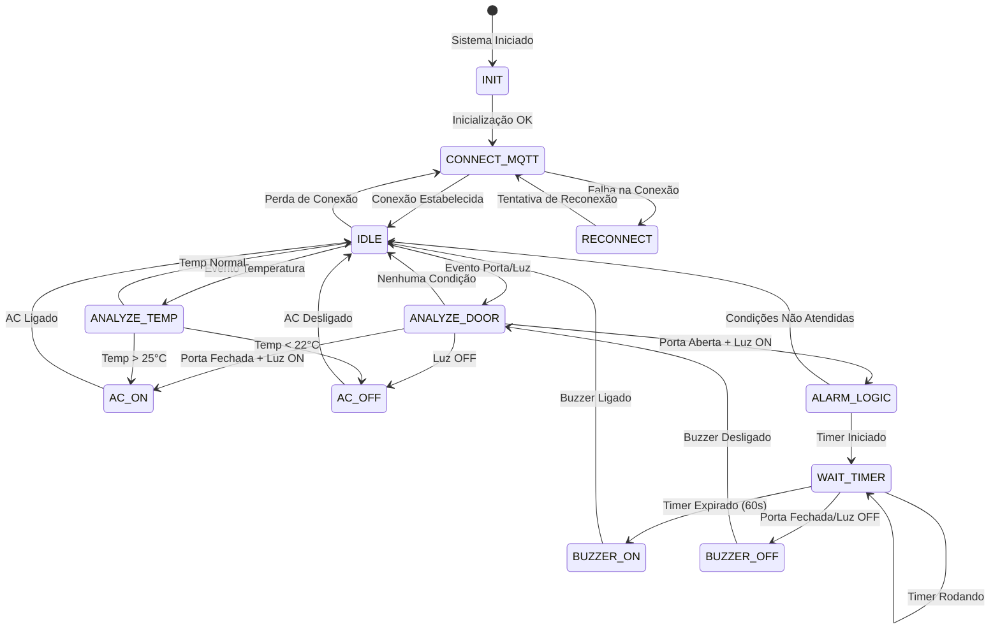
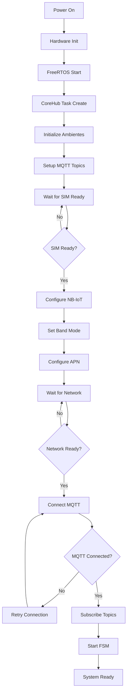
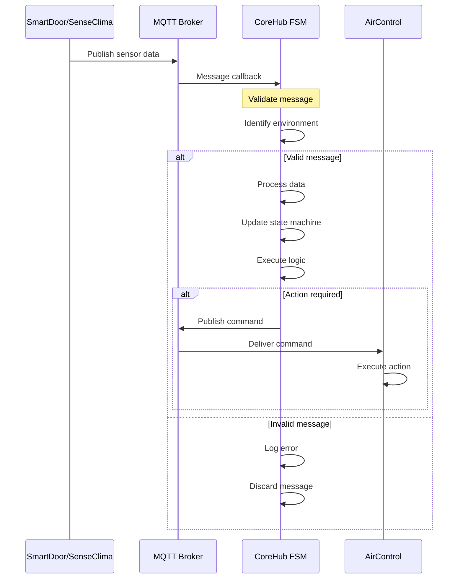
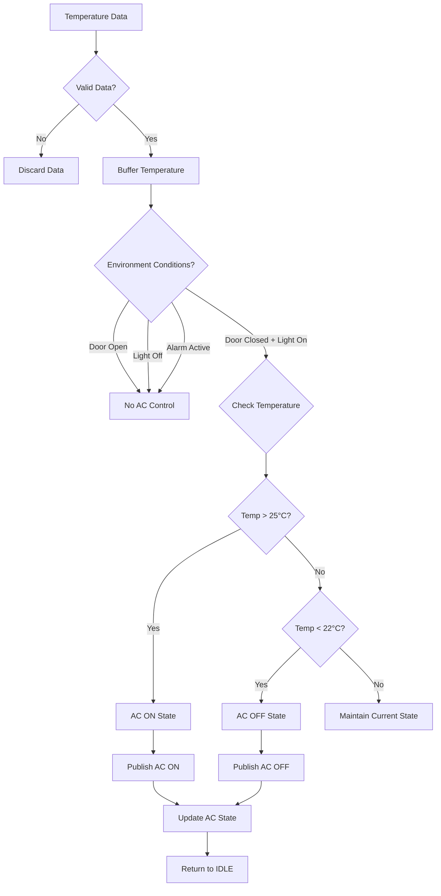
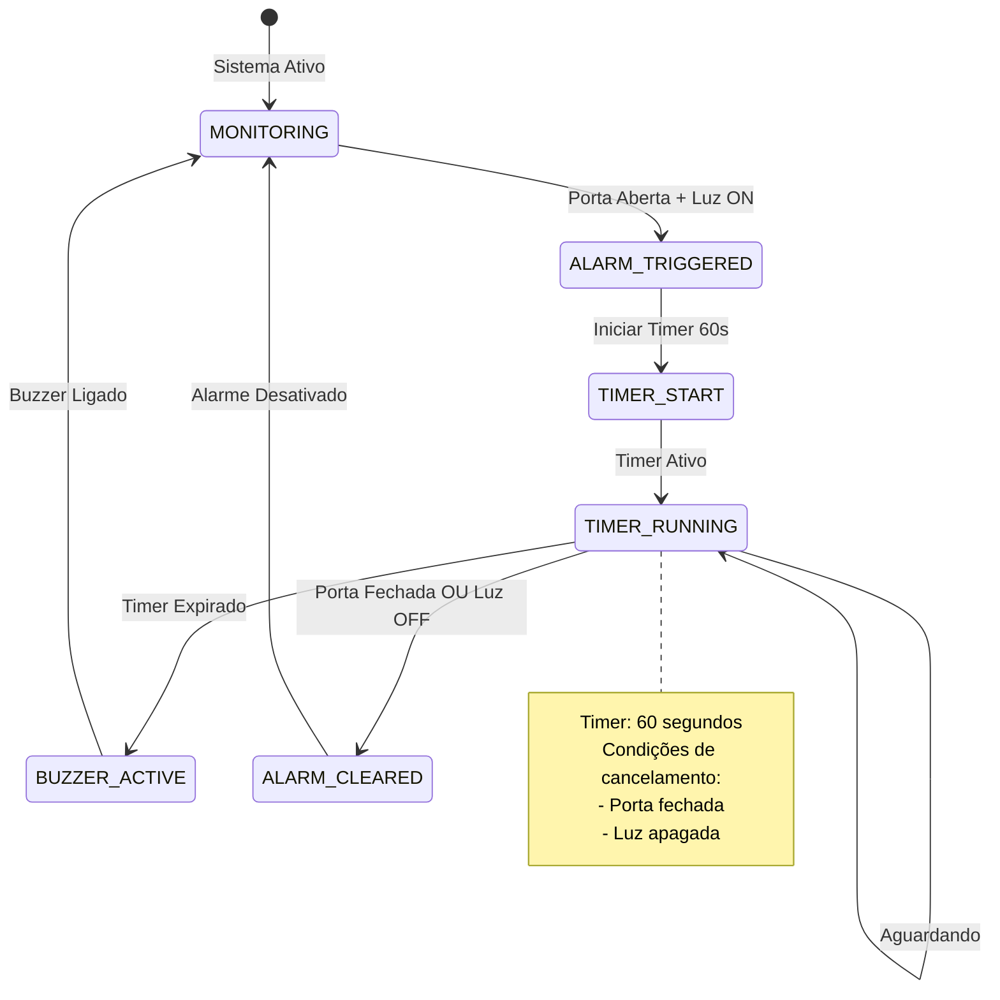
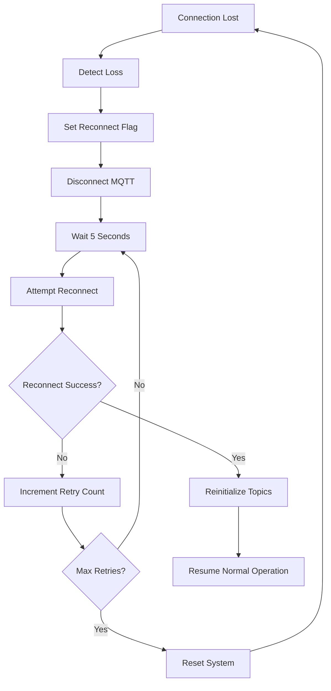
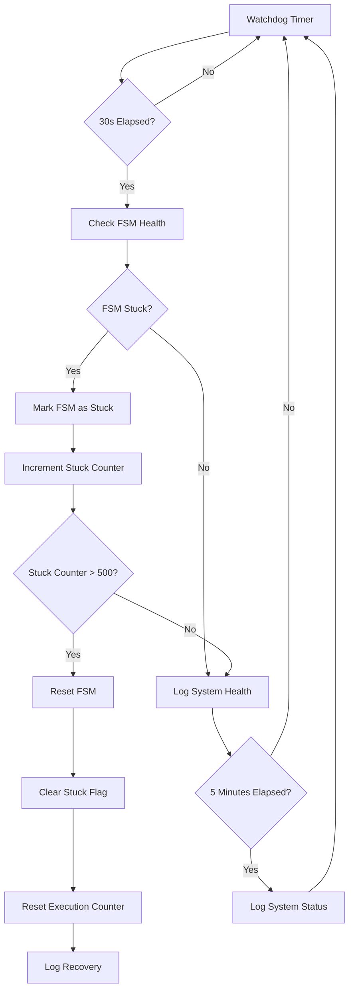
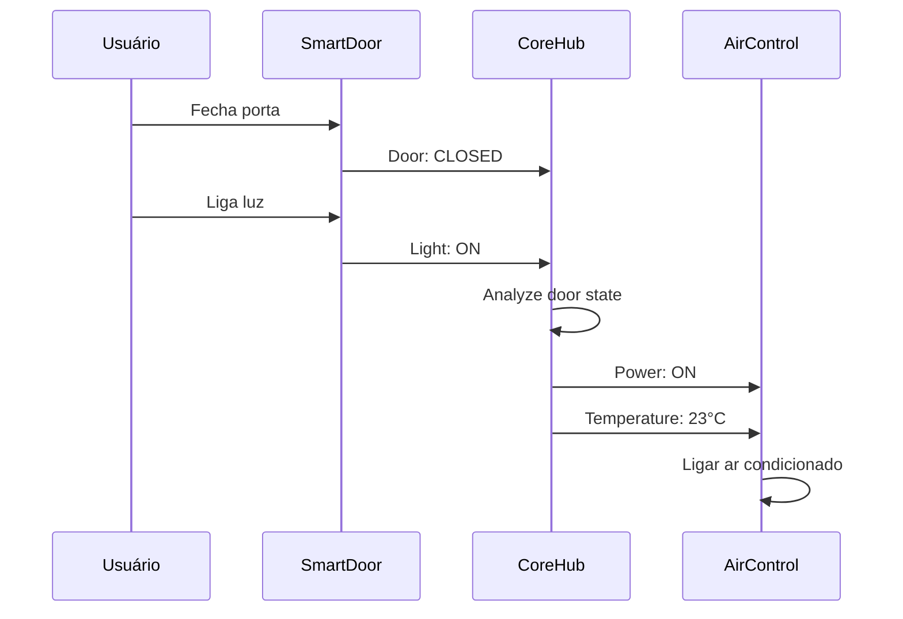
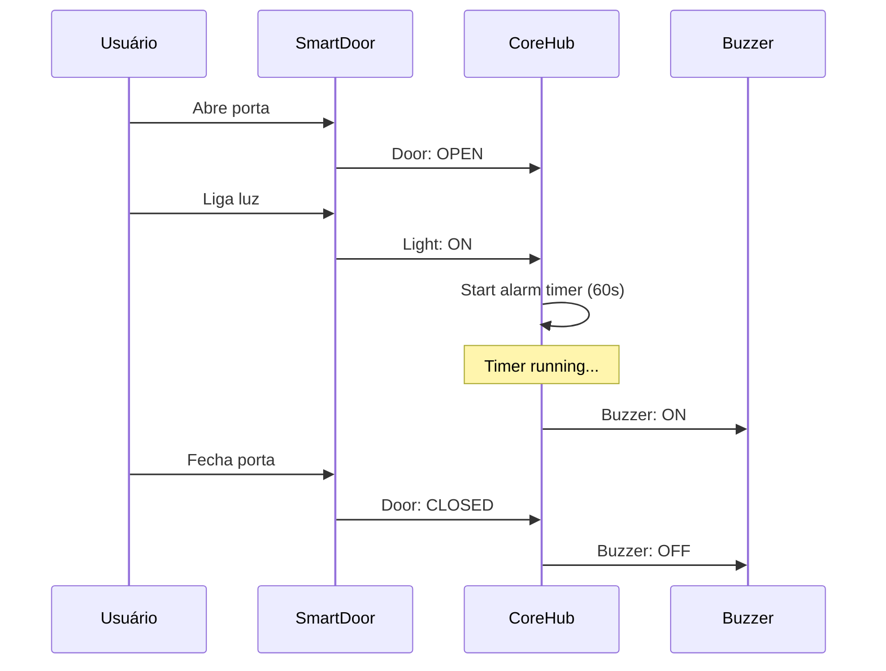
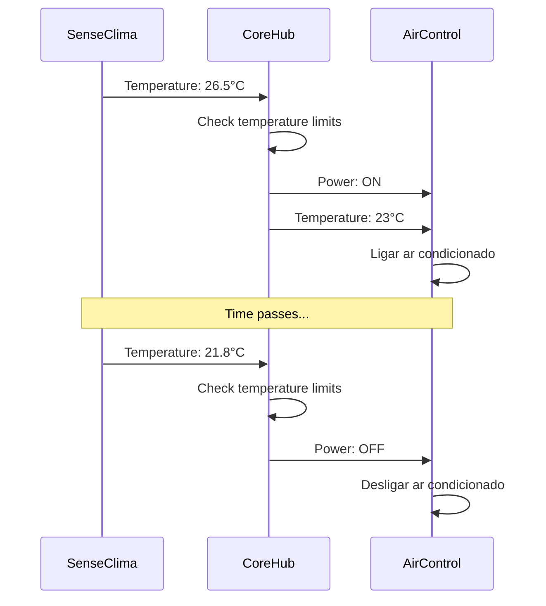

# 🔄 Fluxogramas do CoreHub

> **Sistema de Automação com iMCP HTNB32L**  
> **Diagramas de Fluxo e Estados do Sistema de Automação Inteligente**

---

## 📋 Índice

1. [Máquina de Estados Principal](#máquina-de-estados-principal)
2. [Fluxo de Inicialização](#fluxo-de-inicialização)
3. [Fluxo de Processamento MQTT](#fluxo-de-processamento-mqtt)
4. [Fluxo de Controle de Temperatura](#fluxo-de-controle-de-temperatura)
5. [Fluxo de Alarme](#fluxo-de-alarme)
6. [Fluxo de Reconexão](#fluxo-de-reconexão)
7. [Fluxo de Watchdog](#fluxo-de-watchdog)
8. [Casos de Uso](#casos-de-uso)

---

## 🎯 Máquina de Estados Principal

### 📊 Diagrama de Estados Completo



### 🔄 Transições Detalhadas

| Estado | Condição | Próximo Estado | Ação |
|--------|----------|----------------|------|
| `INIT` | Sistema iniciado | `CONNECT_MQTT` | Inicializar variáveis |
| `CONNECT_MQTT` | Conexão OK | `IDLE` | Configurar MQTT |
| `CONNECT_MQTT` | Falha | `RECONNECT` | Aguardar e tentar |
| `IDLE` | Porta/Luz muda | `ANALYZE_DOOR` | Analisar condições |
| `IDLE` | Temperatura muda | `ANALYZE_TEMP` | Verificar limites |
| `ANALYZE_DOOR` | Porta fechada + Luz ON | `AC_ON` | Ligar ar condicionado |
| `ANALYZE_DOOR` | Luz OFF | `AC_OFF` | Desligar ar condicionado |
| `ANALYZE_DOOR` | Porta aberta + Luz ON | `ALARM_LOGIC` | Ativar lógica de alarme |
| `ANALYZE_TEMP` | Temp > 25°C | `AC_ON` | Ligar ar condicionado |
| `ANALYZE_TEMP` | Temp < 22°C | `AC_OFF` | Desligar ar condicionado |
| `ALARM_LOGIC` | Condições atendidas | `WAIT_TIMER` | Iniciar timer 60s |
| `WAIT_TIMER` | Timer expirado | `BUZZER_ON` | Ligar buzzer |
| `WAIT_TIMER` | Porta fechada/Luz OFF | `BUZZER_OFF` | Desligar buzzer |

---

## 🚀 Fluxo de Inicialização

### 📊 Diagrama de Inicialização



### 🔧 Detalhes da Inicialização

```c
// Sequência de inicialização
void HT_CoreHub_InitSystem(void) {
    // 1. Inicializar hardware
    BSP_CommonInit();
    
    // 2. Inicializar FreeRTOS
    osKernelInitialize();
    
    // 3. Criar task principal
    xTaskCreate(HT_CoreHubTask, "CoreHub", 
               HT_COREHUB_TASK_STACK_SIZE, NULL, 
               HT_COREHUB_TASK_PRIORITY, NULL);
    
    // 4. Inicializar ambientes
    for (int i = 0; i < NUM_AMBIENTES; i++) {
        HT_CoreHub_InitAmbiente(i, ambientes[i]);
    }
    
    // 5. Iniciar kernel
    osKernelStart();
}
```

---

## 📡 Fluxo de Processamento MQTT

### 📊 Diagrama de Processamento MQTT



### 🔄 Processamento de Mensagens

```c
// Fluxo de processamento MQTT
static void HT_CoreHub_MessageCallback(MessageData *msg) {
    // 1. Validação de entrada
    if (!validateMessage(msg)) {
        return;
    }
    
    // 2. Identificação do ambiente
    int ambiente_idx = CoreHub_IdentificaAmbientePorTopico(topic);
    if (ambiente_idx < 0) {
        return;
    }
    
    // 3. Processamento por tipo
    if (strstr(topic, "smartdoor/door")) {
        processDoorMessage(ambiente_idx, payload);
    } else if (strstr(topic, "smartdoor/light")) {
        processLightMessage(ambiente_idx, payload);
    } else if (strstr(topic, "senseclima/01/temperature")) {
        processTemperatureMessage(ambiente_idx, payload);
    } else if (strstr(topic, "senseclima/01/humidity")) {
        processHumidityMessage(ambiente_idx, payload);
    }
    
    // 4. Atualização da FSM
    updateStateMachine(ambiente_idx);
}
```

---

## 🌡️ Fluxo de Controle de Temperatura

### 📊 Diagrama de Controle de Temperatura



### 🌡️ Lógica de Controle

```c
// Controle de temperatura
case COREHUB_IDLE_STATE:
    if (new_temp_data[ambiente_idx]) {
        data->temperature = buffered_temp[ambiente_idx];
        new_temp_data[ambiente_idx] = 0;
        
        // Verificar condições para controle de AC
        if (data->door_state == 0 && data->light_state == 1 && 
            !data->alarm_active && !data->buzzer_state) {
            
            if (data->temperature > HT_COREHUB_TEMP_LIMIT_UPPER) {
                printf("[CoreHub][%s] Temp %.1f°C > %.1f°C - Ligando AC\n", 
                       ambientes[ambiente_idx], data->temperature, 
                       HT_COREHUB_TEMP_LIMIT_UPPER);
                *state = COREHUB_AC_ON_STATE;
            } else if (data->temperature < HT_COREHUB_TEMP_LIMIT_LOWER) {
                printf("[CoreHub][%s] Temp %.1f°C < %.1f°C - Desligando AC\n", 
                       ambientes[ambiente_idx], data->temperature, 
                       HT_COREHUB_TEMP_LIMIT_LOWER);
                *state = COREHUB_AC_OFF_STATE;
            }
        }
    }
    break;
```

---

## 🚨 Fluxo de Alarme

### 📊 Diagrama de Alarme



### 🔔 Lógica de Alarme

```c
// Estados de alarme
case COREHUB_ALARM_LOGIC_STATE:
    if (data->door_state == 1 && data->light_state == 1 && !data->alarm_active) {
        data->alarm_active = 1;
        data->alarm_start_time = CoreHub_GetTimeSecs();
        printf("[CoreHub][%s] ALARME ATIVADO - Timer iniciado\n", ambientes[ambiente_idx]);
        *state = COREHUB_WAIT_TIMER_STATE;
    } else {
        *state = COREHUB_IDLE_STATE;
    }
    break;

case COREHUB_WAIT_TIMER_STATE:
    if (data->alarm_active) {
        uint32_t elapsed = CoreHub_GetTimeSecs() - data->alarm_start_time;
        uint32_t timeout = HT_COREHUB_ALARM_TIMEOUT_MS / 1000;
        
        if (elapsed >= timeout) {
            *state = COREHUB_BUZZER_ON_STATE;
        } else if (!data->door_state || !data->light_state) {
            *state = COREHUB_BUZZER_OFF_STATE;
        }
    } else {
        *state = COREHUB_IDLE_STATE;
    }
    break;
```

---

## 🔄 Fluxo de Reconexão

### 📊 Diagrama de Reconexão



### 🔄 Lógica de Reconexão

```c
// Reconexão MQTT
void HT_CoreHub_Reconnect(void) {
    int retry_count = 0;
    const int max_retries = 10;
    
    while (retry_count < max_retries) {
        printf("[CoreHub] Tentativa de reconexão %d/%d\n", retry_count + 1, max_retries);
        
        // Tentar reconectar
        int result = HT_MQTT_Connect(&mqttClient_global, &mqttNetwork_global,
                                   (char*)broker_addr, broker_port,
                                   HT_MQTT_SEND_TIMEOUT, HT_MQTT_RECEIVE_TIMEOUT,
                                   (char*)clientID, (char*)username, (char*)password,
                                   HT_MQTT_VERSION, HT_MQTT_KEEP_ALIVE_INTERVAL,
                                   mqttSendbuf_global, HT_COREHUB_MQTT_BUFFER_SIZE,
                                   mqttReadbuf_global, HT_COREHUB_MQTT_BUFFER_SIZE);
        
        if (result == 0) {
            printf("[CoreHub] Reconexão bem-sucedida\n");
            
            // Reinscrever nos tópicos
            for (int i = 0; i < NUM_AMBIENTES; i++) {
                HT_MQTT_Subscribe(&mqttClient_global, topic_smartdoor_door[i], QOS0);
                HT_MQTT_Subscribe(&mqttClient_global, topic_smartdoor_light[i], QOS0);
                HT_MQTT_Subscribe(&mqttClient_global, topic_senseclima_temp[i], QOS0);
                HT_MQTT_Subscribe(&mqttClient_global, topic_senseclima_humidity[i], QOS0);
                corehub_data[i].mqtt_connected = 1;
            }
            
            mqtt_connection_active = 1;
            return;
        }
        
        retry_count++;
        vTaskDelay(pdMS_TO_TICKS(5000)); // Aguardar 5 segundos
    }
    
    printf("[CoreHub] Falha na reconexão após %d tentativas\n", max_retries);
    // Reset do sistema se necessário
}
```

---

## 🛡️ Fluxo de Watchdog

### 📊 Diagrama de Watchdog



### 🛡️ Sistema de Watchdog

```c
// Watchdog global
static void CoreHub_WatchdogCheck(void) {
    uint32_t current_time = CoreHub_GetTimeSecs();
    
    // Verificar a cada 30 segundos
    if (current_time - last_watchdog_check < 30) {
        return;
    }
    last_watchdog_check = current_time;
    
    // Verificar se alguma FSM está travada
    for (int i = 0; i < NUM_AMBIENTES; i++) {
        if (fsm_execution_count[i] > 500) {
            fsm_stuck_detected[i] = 1;
            printf("[CoreHub] WATCHDOG: FSM %s detectada como travada\n", ambientes[i]);
        }
    }
    
    // Log de saúde do sistema a cada 5 minutos
    static uint32_t health_log_counter = 0;
    health_log_counter++;
    if (health_log_counter >= 10) { // 30s * 10 = 5 minutos
        printf("[CoreHub] SAÚDE: Sistema operando normalmente (%lu s uptime)\n", current_time);
        health_log_counter = 0;
    }
}
```

---

## 🎯 Casos de Uso

### 🏠 Caso de Uso 1: Controle Automático de AC



### 🚨 Caso de Uso 2: Sistema de Alarme



### 🌡️ Caso de Uso 3: Controle de Temperatura



---

## 📊 Métricas de Fluxo

### ⏱️ Tempos de Resposta

| Operação | Tempo Típico | Tempo Máximo |
|----------|--------------|--------------|
| **Processamento MQTT** | < 10ms | < 50ms |
| **Transição de Estado** | < 5ms | < 20ms |
| **Publicação MQTT** | < 100ms | < 500ms |
| **Reconexão** | < 5s | < 30s |
| **Recuperação Watchdog** | < 1s | < 5s |

### 📈 Estatísticas de Fluxo

| Métrica | Valor | Descrição |
|---------|-------|-----------|
| **Estados por Segundo** | 1 | Execução FSM |
| **Mensagens MQTT/s** | 10-50 | Depende da atividade |
| **Transições/s** | 0.1-1 | Baseado em eventos |
| **Recuperações/s** | < 0.01 | Raro |

---

<div align="center">

**🔄 Fluxogramas CoreHub** - Sistema de Automação Inteligente  
**Visualizando o fluxo de automação com iMCP HTNB32L**

</div> 